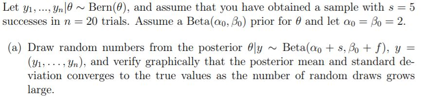
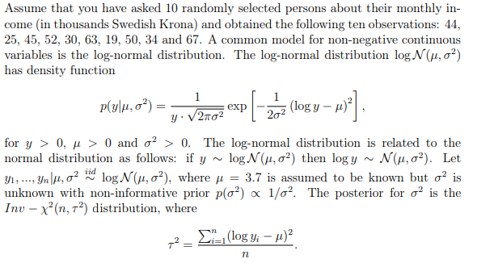
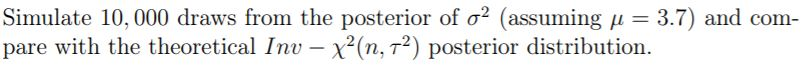
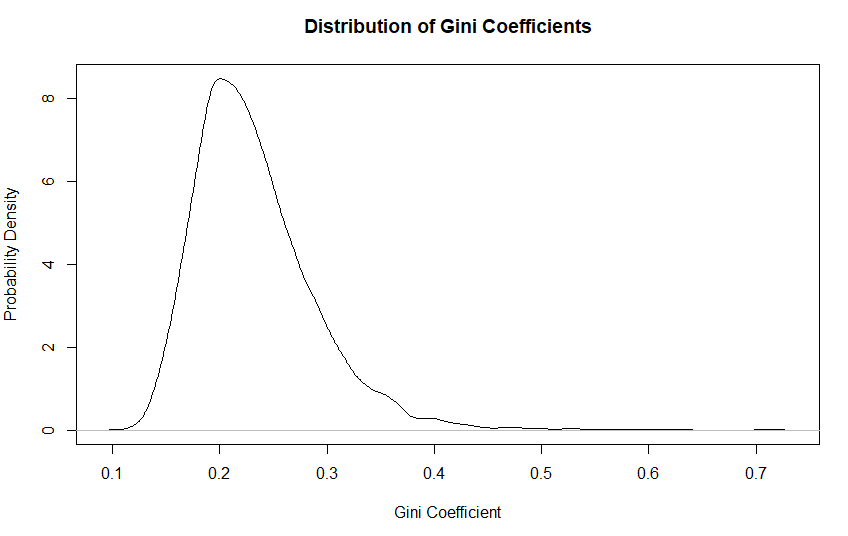
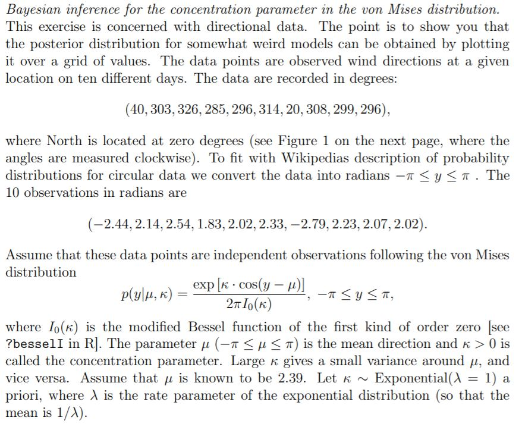

## Computer Lab 1

# Assignment 1

*(1a)

```{r 1aimg, echo = FALSE,out.width= "60%"}

```

As n gets bigger the mean and standard deviation converges towards its true value. Bigger amount of data (n) results in that the prior has less influence on the posterior. 
Mean -> 0,29
st -> 0,09

```{r 1a, echo = FALSE}
vec = c()
deviation = c()
number = c()

# Prior
a = b = 2
s = 5
n = 20
f = n-s

# Posterior
posterior_alpha = s + a
posterior_beta = b + f

for (i in 1:1000){
  post = rbeta (i, posterior_alpha, posterior_beta)
  mean =mean(post)
  st = sd(post)
  vec = append(vec,mean)
  deviation = append(deviation,st)
  number = append(number, i)
}

# Plot theta means
plot(number, vec, type='l', xlab='Number of draws', ylab='Mean of theta')

# Plot theta deviations
plot(number, deviation, type='l', xlab='Number of draws', ylab='Deviation')

```

*(b) Use simulation (nDraws = 10000) to compute the posterior probability*
*Pr(phi > 0.3|y) and compare with the exact value [Hint: pbeta()].*

When similating nDraws = 10000 and counting the cases where the estimated probablity is bigger than 0,3 we see that the value is fairly close to the true value given the data y. Depening on the amount of draws we see that the posterior probaliblity for theta>0,3 given the data will be closer and closer to the true value.

```{r 1b, echo = FALSE}
draws = rbeta(10000, posterior_alpha, posterior_beta)
bigger_than = ifelse(draws>0.3,1,0)
prob_bigger_than = sum(bigger_than)/length(draws)
prob_bigger_than

theta_bigger_than = pbeta(0.3, posterior_alpha, posterior_beta, ncp = 0, lower.tail = FALSE, log.p = FALSE)
print(theta_bigger_than)
```

*c)  Compute the posterior distribution of the log-odds phi = log(phu / (1-phi) by simulation (nDraws = 10000). [Hint: hist() and density() might come in handy]*

The log-odds posterior distribution can be seen in the plot. It looks like the same distribution as the data of shown in histogram. 

```{r 1c, echo = FALSE}
logdraws = log(draws/(1-draws))
densityLogDraws = density(logdraws)
plot(densityLogDraws,
     main = "Log-odds posterior distribution", 
     ylab = "Density",
     xlab = "phi")

hist(logdraws)

```

# Assignment 2

```{r pressure, echo = FALSE, out.width="60%"}



```

*(2a)*

We simulated a distribution from the posterior by drawing 10000 values and using density() to get the distribution. We are aware that density() only fits the data and does not yield the true distribution, but since n is so big (10000) we believe that density() will fit the model realisticly. Using density makes it easier to compare distribution than if we would use a histogram. We compared this distribution with the theoretical distribution and found that they were almost identical.

```{r 2a, echo = FALSE}
my = 3.7
n = 10
Y = c(44,25,45,52,30,63,19,50,34,67)
#compute sample variance s^2
T2 =  sum((log(Y)-my)^2)/n

#Draw X from chi2(n) (This is a draw from Inv- X^2(n,s^2))
set.seed(12345)
XposteriorDraw = rchisq(10000,10)

# get deviation^2 from X ( deviation^2 = df*s^2 /X)
deviationPostDraw = 10*T2/XposteriorDraw
distDeviationPostDraw = density(deviationPostDraw)

library(invgamma)

# function for scaled inverse chi-squared pdf
invscaledchi2 <- function(x, df, tao2) {
  a <- df / 2
  ((n*tao2 / 2)^a)/gamma(a) * x^(-a-1) * exp(-(n*tao2 / 2)/x)
}


# sequence of x-values to illustrate the distribution
xrange = seq(0.01,3.0,0.001)

# values from inverse chisquared mapped on x-range
deviations = invscaledchi2(xrange,10,T2)

# plot simulated distribution with theoretical distribution
plot(distDeviationPostDraw, main="Simulated distribution of deviation vs theoretical distribution")
lines(xrange, deviations, type="l",col="red")
legend("topright",c("Simulated","Theoretical"), col=c("black","red"), lty=1)

```

*2b)*
*Use the posterior draws in a) to compute the posterior distribution of the Gini coefficient G for the current data set.* 

```{r 2b, echo = FALSE, out.width="60%"}

Gini_coefficients = 2*pnorm(deviationPostDraw/sqrt(2),0,1)-1
Gini_density = density(Gini_coefficients)
plot(Gini_density, main = "Distribution of Gini Coefficients", xlab = "Gini Coefficient", ylab = "Probability Density")

```

When plotting the posterior distribution of the Gini Coefficients we can observe that it is very similar to the plot of the posterior distribution sigma^2. It is reasonable that the distribution is similar since the Gini Coeffiecients is just a transfromaion of the sigma^2, since the income has a conjugate prior which is scaled inverse chi-squared.


*2c)*

*Use the posterior draws from b) to compute a 90% equal tail credible interval for G. A 90% equal tail interval (a, b) cuts off 5% percent of the posterior probability mass to the left of a, and 5% to the right of b. Also, do a kernel density estimate of the posterior of G using the density function in R with default settings, and use that kernel density estimate to compute a 90% Highest Posterior Density interval for G. Compare the two intervals*

We obtained a credible interval of (0.046,0.21) and a highest posterior density interval of (0.33,0.176). We used the default kernel (Gaussian) with the default bandwidth for the HDI. In symmetric distributions, credible interval and HDI will return same results. With skewed distributions such as this one the HDI will move to the more probable values while credible interval is limited to the 5 and 95 percentile. Since the HDI covers more probable values we believe that this interval seems to be a more intuitive and meaningful summary of the posterior. 

```{r 2c, echo = FALSE}
GiniQuantiles = quantile(Gini_coefficients, probs=seq(0,1,0.05))
Crediblerange = c(GiniQuantiles[2],GiniQuantiles[20])
# gets range (0.046,0.21)

#Also, do a kernel density estimate of the posterior of G using the density function in R with
#default settings, and use that kernel density estimate to compute a 90% Highest
#Posterior Density interval for G. Compare the two intervals

# using library from CRAN to get highest (posterior) density interval
library(HDInterval)
hdiRange = hdi(Gini_density, credMass=0.9)
# gets range (0.033,0.176)
```


# Assignment 3

*(3a) Plot the posterior distribution of κ for the wind direction data over a fine grid of κ value*

The posterior distribution of k is obtained through the proportinality on likelihood vector of y|k multiplied by probability distribution p(k). Since the prior distribution of k is given the probability vector of k can be calculated. The likelihood vector of y|k is obtained by feeding the given likelihood function with the k values used to create the probability vector of k. By the final mltiplikation likelilhood(y|k)*p(k) we the get the posterior density for all values of k. 

p(k|y) proportial to p(y|k)*p(k)

```{r 3a, echo = FALSE, out.width="60%"}

y = c(-2.44, 2.14, 2.54, 1.83, 2.02, 2.33, -2.79, 2.23, 2.07, 2.02)
my = 2.39
lambda = 1

k_prior = function(lambda, k){
  lambda*exp(-lambda*k) 
}

sequence = seq(0.1, 5, 0.1)
k_prior_vector = k_prior(lambda, sequence)


likelihood_function = function(k, y, my){
  prod(exp(k*cos(y-my))/(2*pi*besselI(k, 0)))
}

likelihood_vector = c()
test = c()
for (k in sequence){
  likelihood_vector = append(likelihood_vector, likelihood_function(k, y, my))
}

k_posterior = likelihood_vector*k_prior_vector
plot(sequence, k_posterior, main = "Posterior distribution of K", xlab = "K", ylab = "Density" )
```


*(b)Find the(approximate) posterior mode of κ from the information in a)*

By finding the maximum value of the density and extracting its index we can then get the k value which results in the highest probability

```{r 3b, echo = FALSE}
k_index = which(k_posterior == max(k_posterior))
k_mode = sequence[k_index]
  
```


```{r code, eval= FALSE, echo = TRUE }

# Bernoulli ... again.
# Let y1, ..., yn|?? ??? Bern(??), and assume that you have obtained a sample with s = 5
# successes in n = 20 trials. Assume a Beta(??0, ??0) prior for ?? and let ??0 = ??0 = 2.

# a)
# Draw random numbers from the posterior ??|y ??? Beta(??0 + s, ??0 + f), y = (y1, . . . , yn), 
# and verify graphically that the posterior mean and standard deviation
# converges to the true values as the number of random draws grows large.

vec = c()
deviation = c()
number = c()

# Prior
a = b = 2
s = 5
n = 20
f = n-s

# Posterior
posterior_alpha = s + a
posterior_beta = b + f

for (i in 1:1000){
  post = rbeta (i, posterior_alpha, posterior_beta)
  mean =mean(post)
  st = sd(post)
  vec = append(vec,mean)
  deviation = append(deviation,st)
  number = append(number, i)
}

# Plot theta means
plot(number, vec, type='l', xlab='Number of draws', ylab='Mean of theta')

# Plot theta deviations
plot(deviation)
plot(number, deviation, type='l', xlab='Number of draws', ylab='deviation')


#USing the alpha and B from teh psoterior distribution
variance_posterior= ((a+s)*(b+f)/((a+s+b+f)^2*(a + s + b +f +1)))^(1/2)
expected_mean = (a +s)/(a + s + b +f)


# The posterior a beta(alpha + s, beta + f). According to the table of distributions we see formulas for 
#E[posterior] and v[posterior] => E[posterior] = (a +s)/(a + s + b +f). 
#V[posterior] = (a+s)(b+f)/(a+s+b+f)^2*(a + s + b +f +1)
# Plot these and see that as n gets large the values converge to this


# b)
# Use simulation (nDraws = 10000) to compute the posterior probability 
# Pr(?? > 0.3|y) and compare with the exact value [Hint: pbeta()].

draws = rbeta (10000, posterior_alpha, posterior_beta)
bigger_than = ifelse(draws>0.3,1,0)
prob_bigger_than = sum(bigger_than)/length(draws)
prob_bigger_than


theta_bigger_than = pbeta(0.3, posterior_alpha, posterior_beta, ncp = 0, lower.tail = FALSE, log.p = FALSE)
print(theta_bigger_than)

# c) 
# Compute the posterior distribution of the log-odds ?? = log(?? / 1?????)
# by simulation (nDraws = 10000). [Hint: hist() and density() might come in handy]

logdraws = log(draws/(1-draws))
densityLogDraws = density(logdraws)
plot(densityLogDraws,
     main = "Log-odds posterior distribution", 
     ylab = "Density",
     xlab = "phi")

hist(logdraws)

## ASSIGNEMNT 2

# Log-normal distribution and the Gini coefficient.
# Assume that you have asked 10 randomly selected persons about their monthly income
# (in thousands Swedish Krona) and obtained the following ten observations: 44,
# 25, 45, 25, 30, 33, 19, 50, 34 and 67. A common model for non-negative continuous
# variables is the log-normal distribution

# a)
# Simulate 10, 000 draws from the posterior of ??2
# (assuming µ = 3.7) and compare with the theoretical 
# Inv ??? ??2(n, ?? 2) posterior distribution.

my = 3.7
n = 10

Y = c(44,25,45,52,30,63,19,50,34,67)
#compute sample variance s^2
T2 =  sum((log(Y)-my)^2)/n

#Draw X from chi2(n) (This is a draw from Inv- X^2(n,s^2))
set.seed(12345)
XposteriorDraw = rchisq(10000,10)

# get deviation^2 from X ( deviation^2 = df*s^2 /X)
deviationPostDraw = 10*T2/XposteriorDraw
distDeviationPostDraw = density(deviationPostDraw)

library(invgamma)

# function for scaled inverse chi-squared pdf
invscaledchi2 <- function(x, df, tao2) {
  a <- df / 2
  ((n*tao2 / 2)^a)/gamma(a) * x^(-a-1) * exp(-(n*tao2 / 2)/x)
}


# sequence of x-values to illustrate the distribution
xrange = seq(0.01,3.0,0.001)

# values from inverse chisquared mapped on x-range
deviations = invscaledchi2(xrange,10,T2)

# plot simulated distribution with theoretical distribution
plot(distDeviationPostDraw)
lines(xrange, deviations, type="l",col="red")


# b)
# Use
#the posterior draws in a) to compute the posterior distribution of the Gini
#coefficient G for the current data se

#Use draws from posterior to form GiniCoeffient
Gini_coefficients = 2*pnorm(sqrt(deviationPostDraw)/sqrt(2),0,1)-1
Gini_density = density(Gini_coefficients)
plot(Gini_density, main = "Distribution of Gini Coefficients", xlab = "Gini Coefficient", ylab = "Probability Density")

#c
#Use the posterior draws from b) to compute a 90% equal tail credible interval
#for G. A 90% equal tail interval (a, b) cuts off 5% percent of the posterior
#probability mass to the left of a, and 5% to the right of b.

GiniQuantiles = quantile(Gini_coefficients, probs=seq(0,1,0.05))
Crediblerange = c(GiniQuantiles[2],GiniQuantiles[20])
# gets range (0.1385257,0.3431806)

#Also, do a kernel density estimate of the posterior of G using the density function in R with
#default settings, and use that kernel density estimate to compute a 90% Highest
#Posterior Density interval for G. Compare the two intervals

# using library from CRAN to get highest (posterior) density interval
library(HDInterval)
hdiRange = hdi(Gini_density, credMass=0.9)
# gets range (0.1371345,0.3431806)

hist(Gini_coefficients)
plot(Gini_density)

vec = c()
#Alternatively using sort of the densities
sorted_normalized_y = sort(Gini_density$y, decreasing = TRUE)/sum(Gini_density$y)
sorted_x = Gini_density$x[order(-Gini_density$y)]

count = 0
summa = 0
while(summa <= 0.95){
  count = count + 1
  summa = sorted_normalized[count] + summa
  
}
a = min(sorted_x[1:count-1])
b = max(sorted_x[1:count-1])

# Assignment 3
# a) 
# Plot the posterior distribution of ?? for the wind direction data over a fine grid
# of ?? values


y = c(-2.44, 2.14, 2.54, 1.83, 2.02, 2.33, -2.79, 2.23, 2.07, 2.02)
my = 2.39
lambda = 1

k_prior = function(lambda, k){
  lambda*exp(-lambda*k) 
}

likelihood_function = function(k, y, my){
  prod(exp(k*cos(y-my))/(2*pi*besselI(k, 0)))
}

sequence = seq(0.1, 5, 0.1)

k_prior_vector = k_prior(lambda, sequence)

likelihood_vector = c()
test = c()
for (k in sequence){
  likelihood_vector = append(likelihood_vector, likelihood_function(k, y, my))
}

k_posterior = likelihood_vector*k_prior_vector
plot(sequence, k_posterior, main = "Posterior distribution of K", xlab = "K", ylab = "Density" )


# b)
# Find the approximate  posterior mode of k  from the information in a

k_index = which(k_posterior == max(k_posterior))
k_mode = sequence[k_index]
k_mode
print(k_mode)


```

